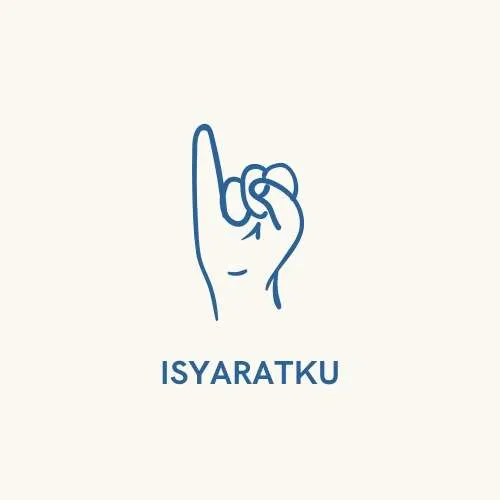

# IsyaratKu

<h1 align="center">
    
</h1>

# Team Member
| Name                       | Student ID  | Path                |
| -------------------------- | ----------- | ------------------- |
| [Nicholas Sidharta](https://www.linkedin.com/in/nicholassidharta/) | M010D4KY3076 | Machine Learning    |
| [Raditya Aditama](https://www.linkedin.com/in/raditya-aditama-709301217/)         | M010D4KY2189 | Machine Learning    |
| [Amelia Ananda Setiawan](https://www.linkedin.com/in/ameliaanandas/)     | M299D4KX2170 | Machine Learning    |
| [Muhammad Azka Obila Vasya](https://www.linkedin.com/in/azkaobila/)    | C006D4KY0767 | Cloud Computing     |
| [Danendra Herdiansyah](https://www.linkedin.com/in/danendra-herdiansyah/) | C010D4KY0934 | Cloud Computing     |
| [Rofik Adam Nugraha](https://www.linkedin.com/in/rofikadamnugraha/)     | A369D4KY4330 | Mobile Development |
| [Nanda Khalid Ahmad](https://www.linkedin.com/in/nanda-khalid-ahmad/)     | A288D4KY4218  | Mobile Development |

# Project Theme
`Empowering Minds: A holistic approach to education and personal development`

# About the Project
Hearing loss affects a substantial population worldwide, with over 1.5 billion people impacted according to the World Health Organization. This issue spans all ages, including 34 million children. By 2050, over 700 million individuals could experience disabling hearing impairment. In Indonesia alone, data from the Ministry of Social Affairs indicates over 223,000 people are deaf while another 73,000 have combined deafness and speech impairments.

Those with severe hearing and speech disabilities rely on sign languages like SIBI (Indonesian Sign Language System), ASL (American Sign Language), and others for communication. However, learning opportunities have been limited, especially in low- and middle-income nations where global hearing aid production meets just 3% of the need.

IsyaratKu is an Android app that aims to increase accessibility by providing an interactive platform for learning sign languages using machine learning technology. Through real-time hand gesture recognition, users can learn signs using IsyaratKu's comprehension exercises. The app also incorporates gamification elements like a leaderboard system to motivate continuous learning. The app caters to both the deaf/speech-impaired community and those without impairments who wish to learn signing to bridge societal divides. By proliferating sign literacy, IsyaratKu helps break down linguistic barriers and fosters a more inclusive society.

# Project Repository
- Machine Learning Team Repository: [colab-repository](https://github.com/IsyaratKu/colab-repository)
- Cloud Computing Team Repository: [isyaratku-backend](https://github.com/IsyaratKu/isyaratku-backend)
- Mobile Development Team Repository: [IsyaratKu-MobileDevelopment](https://github.com/IsyaratKu/IsyaratKu-MobileDevelopment)

# Project Technology Used
      

   

 

